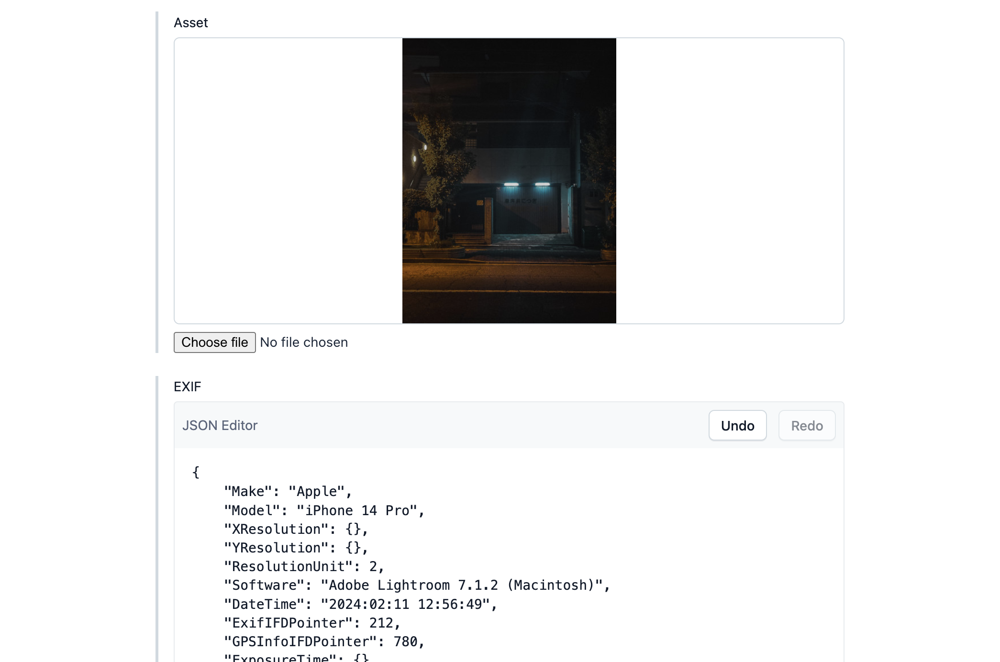

# exif-contentful

Writes EXIF data to a JSON field in Contentful.

## Usage

After installation, create or use a Media field and assign the EXIF app to the field via the Appearance tab in the settings. When uploading an asset through this field, all EXIF data will be added to a field in the same entry with type JSON and ID `exif`. To customize this, check [Field.tsx](/src/locations/Field.tsx).



Then, use the value of `exif` field in the CDA. Example output:

```json
{
  "Make": "FUJIFILM",
  "Model": "X-T30 II",
  "Orientation": 1,
  "XResolution": {},
  "YResolution": {},
  "ResolutionUnit": 2,
  "Software": "Adobe Lightroom 7.1.2 (Macintosh)",
  "DateTime": "2024:01:01 00:00:00",
  "ExifIFDPointer": 212,
  "ExposureTime": {},
  "FNumber": {},
  "ExposureProgram": "Normal program",
  "ISOSpeedRatings": 320,
  "ExifVersion": "0232",
  "DateTimeOriginal": "2024:01:01 00:00:00",
  "DateTimeDigitized": "2024:01:01 00:00:00",
  "ShutterSpeedValue": 7.643855995239512,
  "ApertureValue": {},
  "BrightnessValue": 5.22,
  "ExposureBias": 0,
  "MaxApertureValue": {},
  "MeteringMode": "Pattern",
  "LightSource": "Unknown",
  "Flash": "Flash did not fire",
  "FocalLength": {},
  "ColorSpace": 1,
  "PixelXDimension": 6240,
  "PixelYDimension": 4160,
  "FocalPlaneXResolution": {},
  "FocalPlaneYResolution": {},
  "FocalPlaneResolutionUnit": 3,
  "SensingMethod": "One-chip color area sensor",
  "FileSource": "DSC",
  "SceneType": "Directly photographed",
  "CustomRendered": "Normal process",
  "ExposureMode": 0,
  "WhiteBalance": "Auto white balance",
  "FocalLengthIn35mmFilm": 41,
  "SceneCaptureType": "Standard",
  "Sharpness": "Normal",
  "SubjectDistanceRange": "Unknown",
  "thumbnail": {}
}
```
