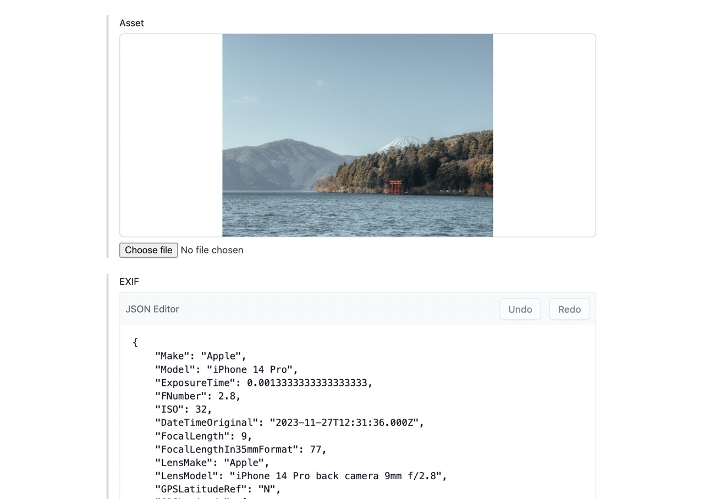

# exif-contentful

Writes EXIF data to a JSON field in Contentful.

## Usage

After installation, create or use a Media field and assign the EXIF app to the field via the Appearance tab in the settings. When uploading an asset through this field, the EXIF data will be added to a field in the same entry with type JSON and ID `exif`. To customize the field ID and the EXIF tags, check [Field.tsx](/src/locations/Field.tsx).



Then, use the value of `exif` field in the CDA. Example output:

```json
{
  "Make": "Apple",
  "Model": "iPhone 14 Pro",
  "ExposureTime": 0.0013333333333333333,
  "FNumber": 2.8,
  "ISO": 32,
  "DateTimeOriginal": "2023-11-27T12:31:36.000Z",
  "FocalLength": 9,
  "FocalLengthIn35mmFormat": 77,
  "LensMake": "Apple",
  "LensModel": "iPhone 14 Pro back camera 9mm f/2.8",
  "GPSLatitudeRef": "N",
  "GPSLatitude": [35, 12.02934, 0],
  "GPSLongitudeRef": "E",
  "GPSLongitude": [139, 1.81482, 0],
  "latitude": 35.200489,
  "longitude": 139.030247
}
```
